# JavaIntelligence+ 项目简介
*Java code static analysis/refactoring tool based on abstract syntax tree and symbol solving*

### 一、简介

**JavaIntelligence+ - 基于抽象语法树与符号解析的 Java 代码静态分析/重构工具**

本项目基于抽象语法树（AST），符号解析器（JavaSymbolSolver）两大核心，使用递归下降的代码解析算法（`LL(K)`）得到 AST ，进而对 Java、Python 语言代码进行分析及重构，实现代码格式化、特定类型命名重构、等价语句互转、空指针异常处理、程序正确性检测及自动修复等功能，并可以进行程序代码规范性打分以及生成代码分析报告，代码重构正确率均达到99%以上。

#### 主要功能
针对 Java/Python 语言的：
* 代码格式化重构功能
* 特定类型命名重构
* 等价语句互转
    * `if` `switch` 转换
    * `for` `while` 转换
    * 等等
* 空指针异常检测
* 工业标准代码风格检测，常见代码基础错误检测
* 代码规范性自动打分
* 自动生成代码分析报告
* 批量重转代码等

#### 开发环境：

- 算法部分
    - IntelliJ IDEA、VSCode
- 展示部分
    - PyCharm
- 多人协作
    - Git、Gogs、GitHub

#### 技术梗概：
- 算法部分
    - Maven
    - JDK 1.8
    - JavaParser
    - JavaSymbolSolver

- 展示部分
    - 后端
        - Django
    - 前端
        - Bootstrap
        - Monaco Editor
        - AJAX

### 二、核心算法简介
#### AST生成
解析器 JavaParser：给定源文件，它可利（编译器前端）解析算法构建 AST。这也是静态分析的第一步工作，在拿到 AST 之后就可以通过遍历等方式进行简单的修改操作。
#### 符号解析
有时AST是不够的，当想要了解某个符号的具体属性及声明位置：一个字段？一个局部变量？或是需要知道复杂表达式的类型，希望获得某个类实现（或间接实现）的所有接口的列表等。这时需要 SymbolSolver。
JavaSymbolSolver 分析 AST 并对每一个符号加入链接到声明位置的“指针”，以构建符号表。e.g., AST中的 `foo` 只是一个 `NameExpr`，而 SymbolSolver 可以获得它是指向参数、局部变量还是字段，并且可得到类型信息，这极大地方便了以后的分析工作。

### 三、目录介绍

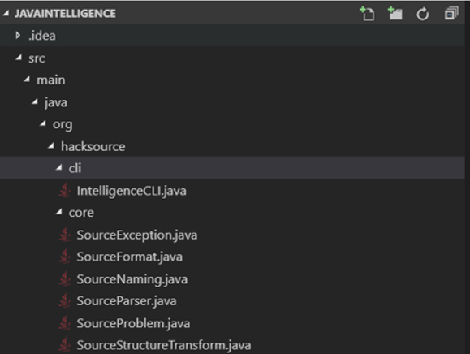

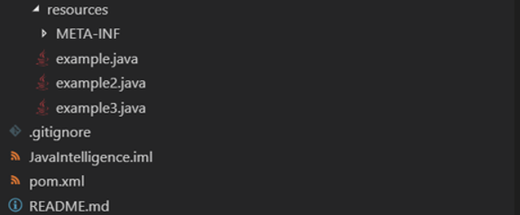

| 描述 | 目录 |
| ---- | ---- |
| 命令行交互 | src/main/java/org/hacksource/cli |
| 核心算法 | src/main/java/org/hacksource/core |
| 测试资源 | src/main/resources |

*注：单元测试未独立成类，而是写在核心算法内*

### 四、快速开始

#### 在线环境（推荐）
进入 http://parser.iqust.top 即可使用

注：
- 第一次加载可能较慢，请耐心等待
- 代码必须是一个完整的 java 文件，而不能是一个代码段，如一个赋值语句等（这是因为只有完整的代码段才能由符号分析器推导出变量类型及其依赖关系）
- 目前仅适配了电脑端，手机端由于没有写代码的需求所以并未完全适配，但依然可以工作

如图所示，左面输入代码，点击 Run 后，右边则给出重构后的代码，前端本身提供了几个示例代码（下拉列表框“实例代码”处）

#### 本机搭建
1. 使用 Maven 或打开 IntelliJ IDEA 构建项目，生成 jar 包
1. 如果不想搭建 Web 在线平台，则可直接运行 jar 包（注：主类为 `org.hacksource.cli.IntelligenceCLI`），而后在标准输入中输入代码，得到返回的 json 数据（不太直观，推荐通过 Web 平台查看可视化结果）；若想搭建 Web 平台则按照下面的步骤
1. 将在 web 目录下的 django 项目部署到本机或服务器上，运行此项目

### 五、测试

**测试代码与运行结果截图**

**测试1（代码格式重构）：**

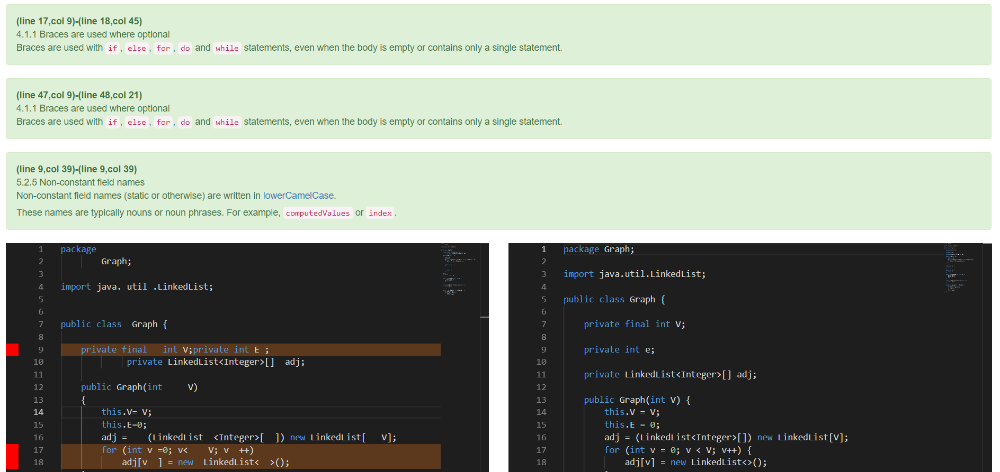

如上图所示，左面为输入的测试代码，右边为运行后重构的代码，运行后会将代码不规范的地方高亮显示，并定位到具体格式有问题的行与列，在最上方给出具体的规范说明（部分空行、空格、回车等非常广泛但平常的格式问题只进行更正不进行高亮提示以及规范说明）。重构后，正确率在99%以上，包括不得省略花括号、换行、空白、表达式圆括号等。

**测试2（特定类型命名重构）：**

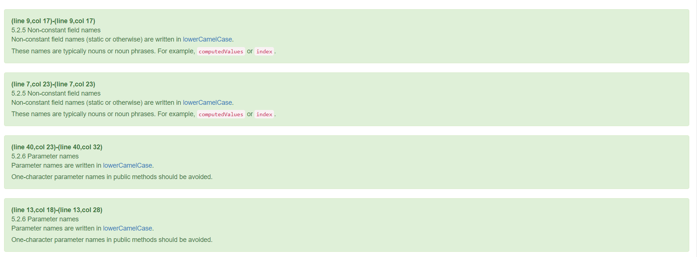

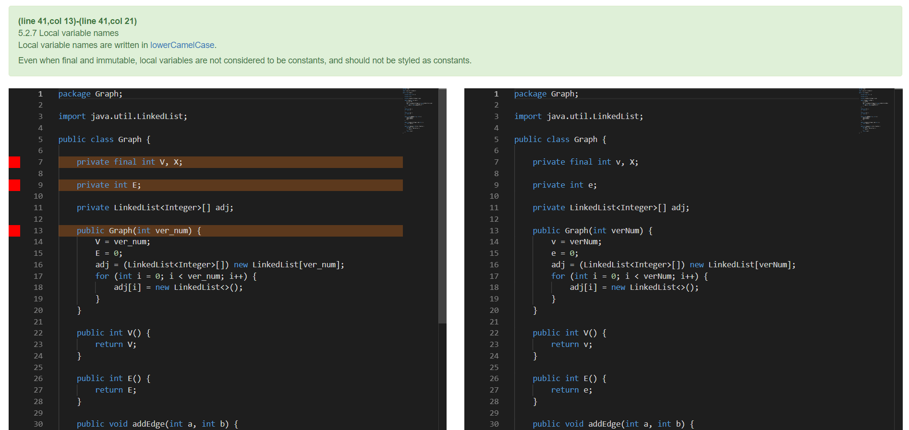

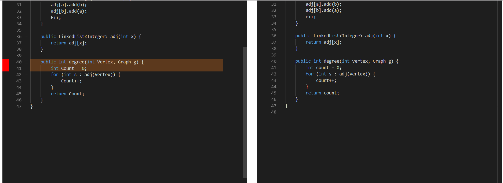

如上图所示，对于命名不规范（不遵循 lowerCamelCase）的变量，运行后，定位到命名不规范变量的位置并高亮显示，在上方给出具体的分析说明，右边则为重构后的代码。重构后，命名正确率在99%以上，包括：包命名，类命名，方法命名，常量命名，成员变量命名，参数命名，局部变量命名等。

**测试3（等价语句互转）：**

1. if switch 互转实例

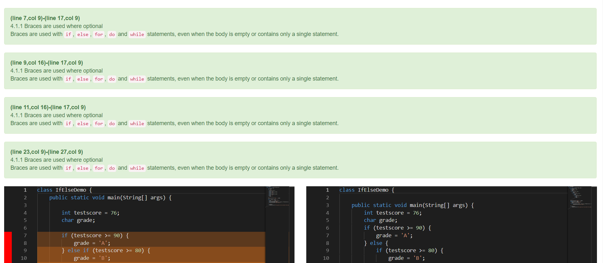

2. for while 互转实例

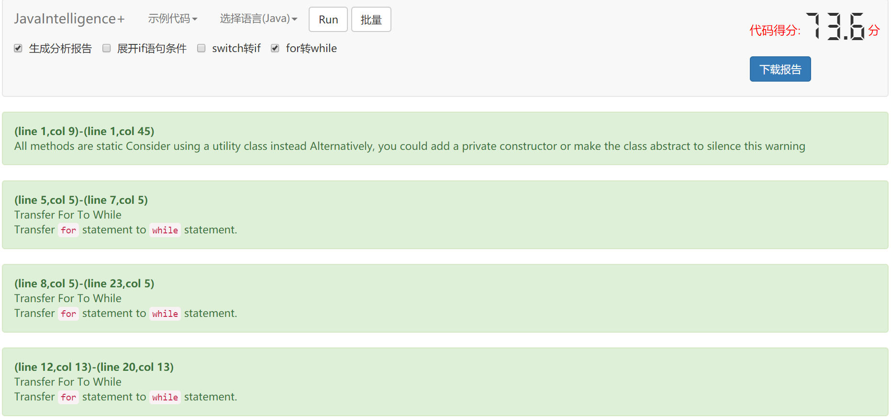

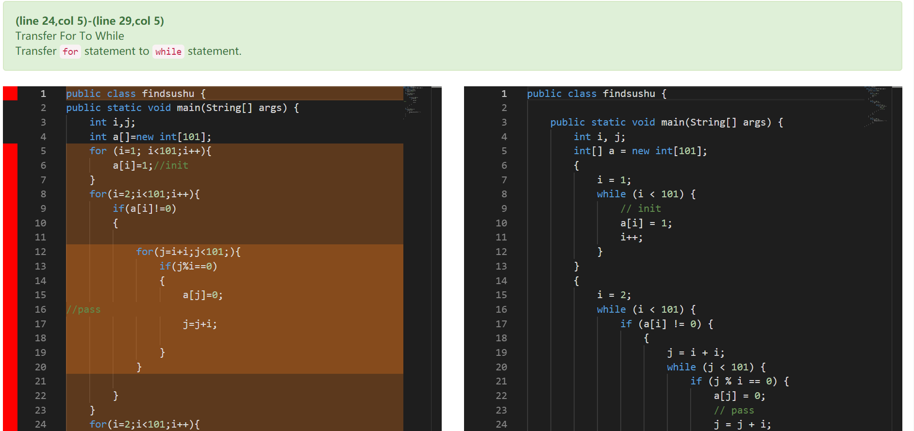

如上图所示，根据给定的代码规范，对于多条件单`if`语句/单条件多`if`语句，for/while，if...elseif/switch等都可进行转换，不满足结构规范的代码，对其结构自动重构，并高亮显示被转换处代码段，并定位到结构规范有问题的行与列，在最上方给出具体的转换说明，重构后，结构正确率在99%以上。

**测试4 （空指针检测）**

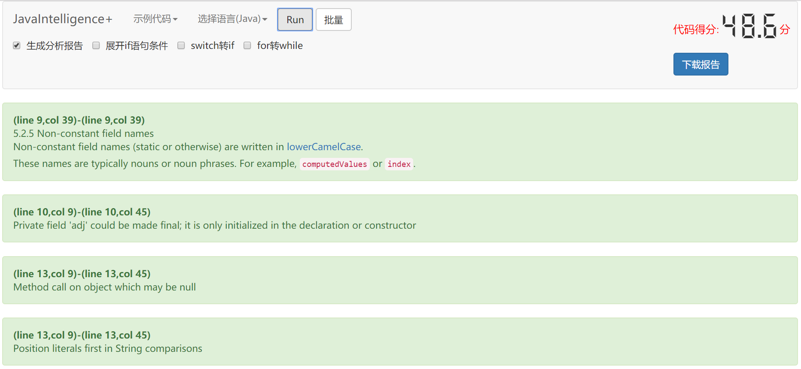

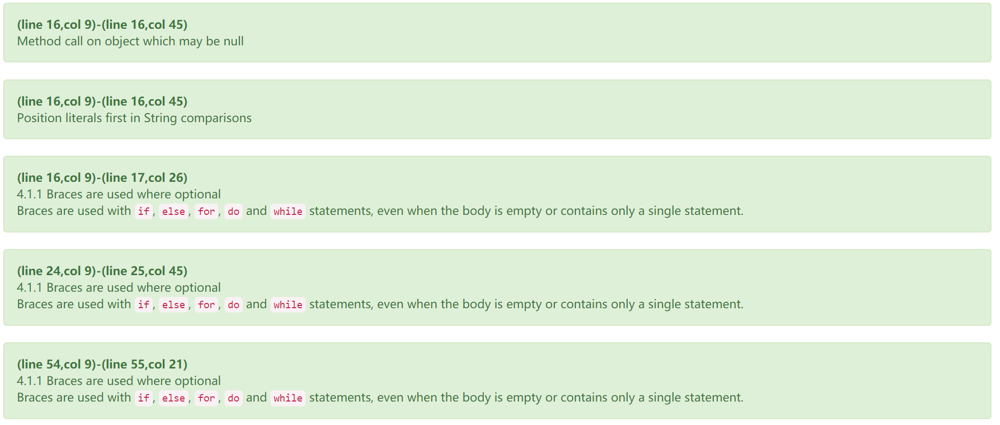

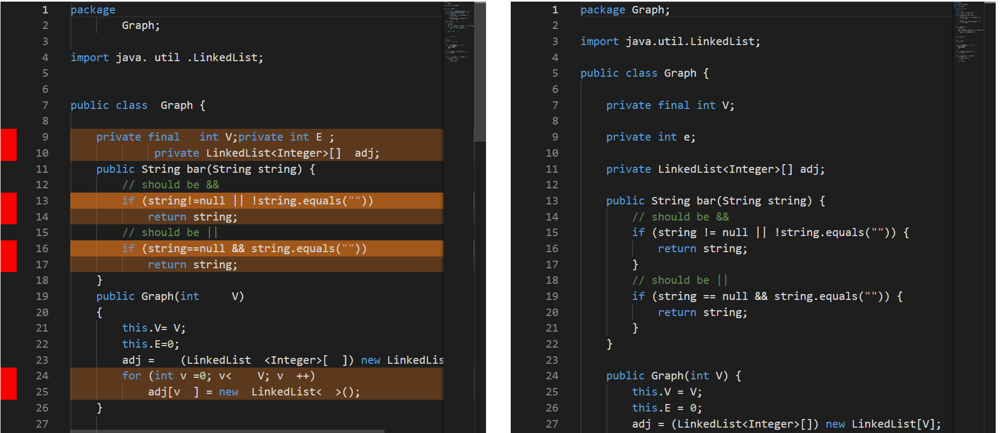

#### python 语言重构

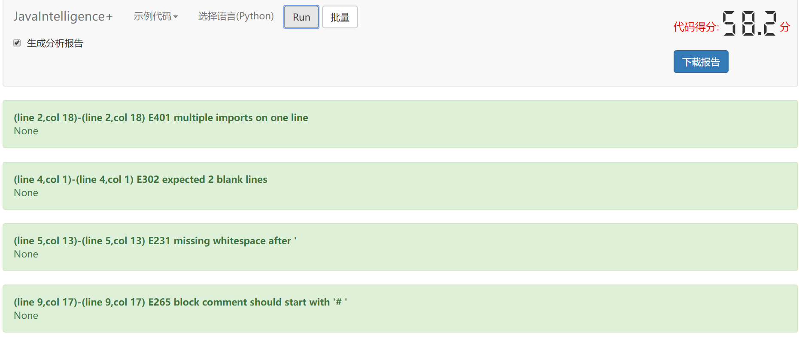

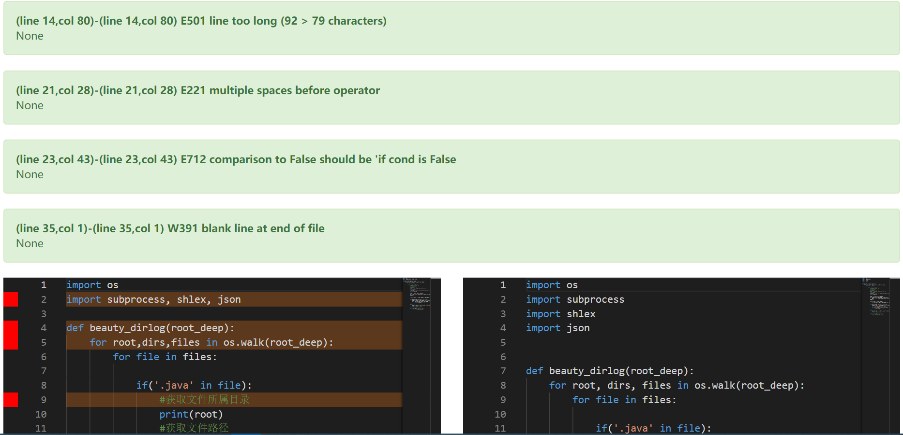

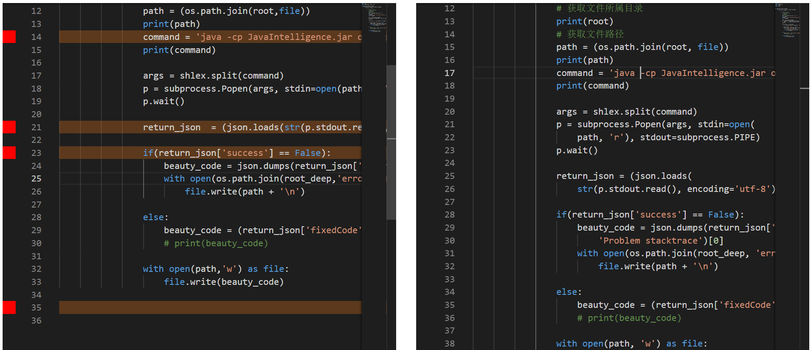

如上图所示，对于不满足 PEP8 规范要求之处，运行后会将代码不规范的地方高亮显示，并定位到具体格式有问题的行与列，在最上方给出具体的规范说明，重构后，结构正确率在99%以上。

#### 自动评分及生成报告实例

##### 自动评分实例

如上图所示，对于每份代码，经过分析及重构，都会根据根据不同错误类型进行分级，而后根据权值打出一个分数，代表了这份代码的规范程度和编码质量。

##### 生成报告实例

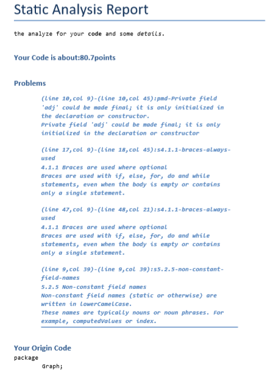

如上图所示，为了方便企业级应用，我们还可以为代码生成 PDF 格式的规范及质量报告，其中包含了通过分析得到的规范性问题、代码得分及重构后的代码等信息。

#### 批量代码重构 

源项目文件：

转换后项目文件（自动生成错误列表）：

如上所示，为了方便大型项目开发实践，我们还提供了批量地重构代码的功能，只需上传代码压缩包系统即可进行解压、重构、然后返回给用户包含了完全被重构之后的代码的压缩包。

### 五、开发者

- 静态分析/重构算法: @PragmaTwice(负责人) @kaqiz @coderigenius
- Web前后端: @kaqiz(负责人) @PragmaTwice
- 文档: @guido-miracle @PragmaTwice

### 六、总结讨论

本项目对 Java 语言代码进行重构，对于不规范代码的位置进行定位并高亮显示，给出详细的分析说明，并进行代码重构，达到很高的正确率。采用前端平台进行展示，方便快捷。实现了代码格式重构、特定类型命名重构、等价语句互转以及程序正确性性检测及自动修复等。这个项目使我们充分了解到静态分析的魅力和发展前景，也使我们坚定了以后的发展方向，我们也会在之后的学习中不断完善发展这个项目，最终惠及广大开发者。
